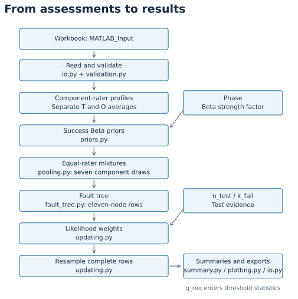
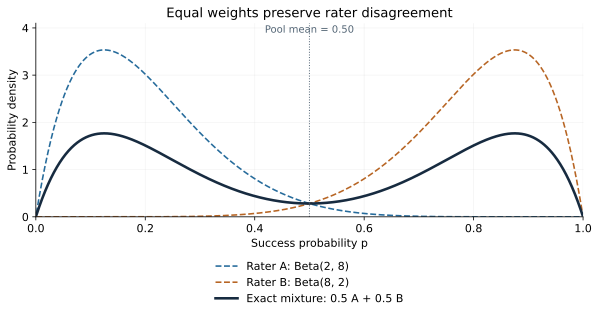
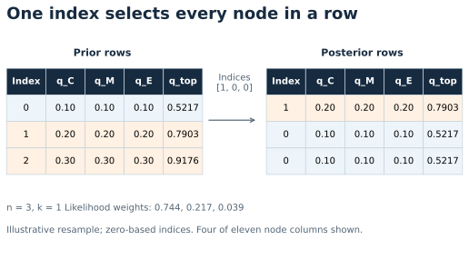

# Review diagrams

## 1. Analysis workflow

Solid arrows carry assessments or samples. Test counts and the requirement
threshold enter at different stages.

## 2. Equal-rater pooling

The dashed curves are two alternative rater priors. The solid curve is their
weighted-average density: 0.5 A + 0.5 B. Its total area is still 1.

Near A's peak, B contributes little, so the solid density is about half of A's
density; the same occurs near B's peak. This allocates belief to both judgments.
It does not mean that physical extreme outcomes became safer or that disagreement
was resolved. Probabilities are areas over intervals, not curve heights.

The mean is 0.50, yet neither rater's distribution is centered there. Keeping both
peaks makes that disagreement visible. For two identical priors, the pooled curve
would be unchanged. The example uses Beta(2, 8) and Beta(8, 2).

## 3. Joint posterior resampling

One selected index supplies every node in a posterior row. Repeated indices
are allowed. Columns shown are a subset of the eleven stored nodes.

## Equation-to-code review

| Calculation | Code | Check |
| --- | --- | --- |
| T/O category averages | `validation.validate_input` | One component, two raters, one excluded row |
| Success Beta parameters | `priors.parameters` | T=3, O=2.5, CDR: mean 0.924; strength 18.2 |
| Mixture mean / variance | `pooling.mixture_moments` | Beta(2,8) + Beta(8,2): mean 0.5; variance 0.104545 |
| Independent OR gates | `fault_tree.fault_tree_nodes` | All zeros; one certain failure; seven q=0.1 give q_top=0.5217031 |
| Likelihood weights | `updating.posterior_weights` | q=[0.1,0.3,0.5], n=3, k=1: normalize [0.081,0.147,0.125] |
| Joint resampling | `updating.resample_joint` | Each posterior row equals one complete prior row |
| Exact system moments | `pooling.success_product_moments` | Compare with the independent derivation in the appendix |
| Output interpretation | `summary.summarize_nodes` | Failure mean, success mean, and Pmeet are distinct |

Use the [walkthrough plan](walkthrough_plan.md) to record decisions.
